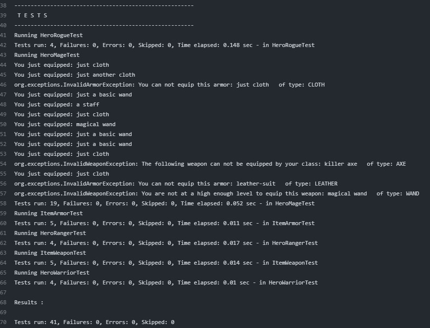
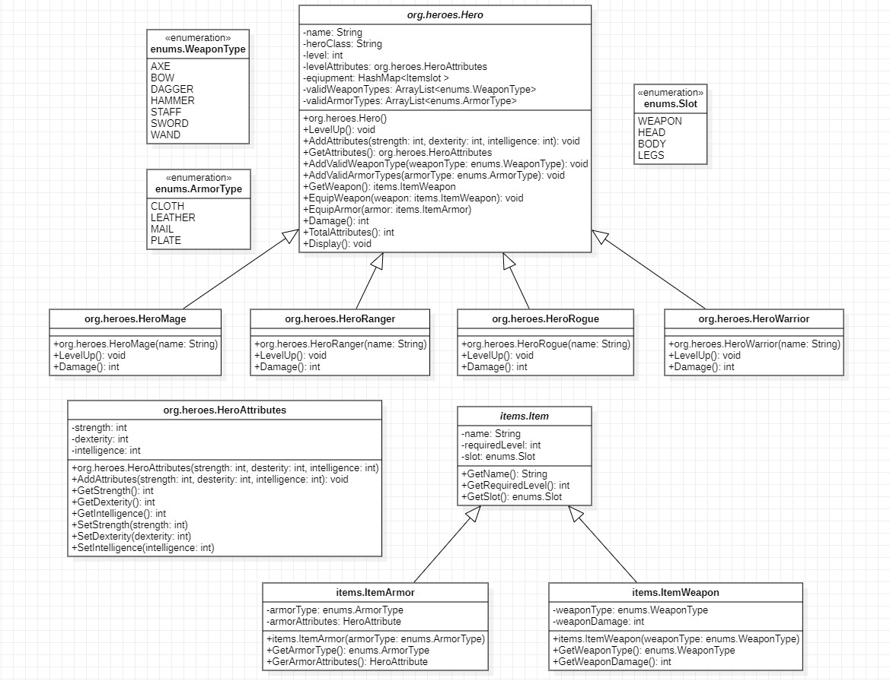

# Java RPGHeroes

This a Java console application using maven and junit to implement and test basic functionality for hero classes in an RPG style game.

## The application
This application implements and tests the basic functionality of an RPG-style game with different classes of heroes. Four different hero classes are implemented: Mage, Rogue, Ranger and Warriror. Each hero can can equip items of either tyep Weapon or type Armor. Depending on the class of the hero, they can only eqiup specific items. Each hero has a set of attributes, based on the popular three stat system (strength, dexterity, intelligence). These attributes are then increased when the user levels up and their total attributes are increased when equipping armor.

## Test report
The test report can be viewed under the actions tab in the github repository. In git hub action, pick the lastest executes action and navigate to the "Test report session". Here the console output from the program can be viewed showcasing the number of sucessfully excuted tests. If the test report can not be viewed then the output is seen below.

## Class diagram
A class diagram for the application can be viewed below and is also found in the repository. This details the initail design of the classes and their relationships. Some parts of the classes changed slightly during development such as moving the damage() method to the abstract hero class.

